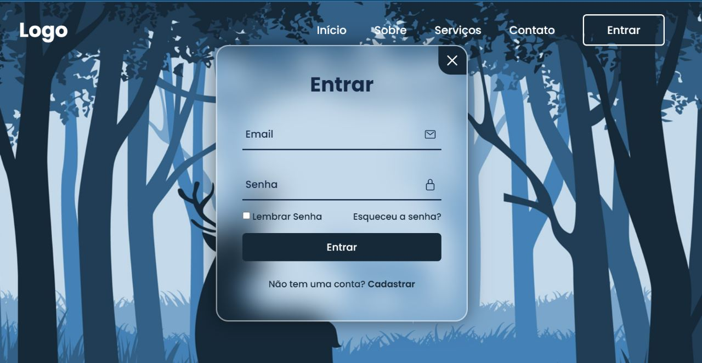

<h1>Login Website</h1>
  

<h2>Project Deploy</h2>
 <a href="https://login-website-6gafghr5a-lucaslandivar.vercel.app">Click here</a>
  
<h2>Description of the project</h2>

My goal with this project was to develop a dynamic login system. In one of my past projects, I made a password generator system to login, but I realized that that page was very static and dull, so I decided to improve the aesthetic and dynamic part.
In this new login system, the user can close both the login window and the registration window. When the user enters the registration window, the login window is automatically closed, thus leaving space in the central div just for the registration window.
It's a simple dynamic, but it gives the site another face, I really liked it and makes the login system stop being that monotonous and boring thing.
What's my next goal? Now that I've managed to learn more about how to make a login system with my projects, I'm going to use the knowledge from this project to make the interface, the knowledge from my password generator project to leave the registration area with more options and I'm going to use knowledge from my Quiz App and To-Do List projects to store login information in the browser.
 

<h2>Why i make this project?</h2>

I make this project so i can improve my login interface for my future projects.

<h2>How does this project work?</h2>

When the user click on the login button, in the center of the page will appar a div with the form for login, if the user what to create an account, in the same div there will be another form for the user to register. The two interfaces, the login and the register form appear in the same div, but they switch eachother.

<h2>Tecnologies</h2>

HTML

CSS

JavaScript

<h2>Status</h2>

Finish.

<h2>Author</h2>

Lucas Landivar de Morais

